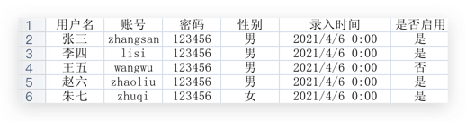

# excel-spring-boot-starter

> 利用 easyexcel 进行数据导入导出

## 依赖

```xml
<dependency>
    <groupId>tk.fishfish</groupId>
    <artifactId>excel-spring-boot-starter</artifactId>
    <version>1.5.0-SNAPSHOT</version>
</dependency>
```

## 快速使用



### 读

默认第一行为表头字段，数据为标准行列。

#### 转为map

使用例子：

```java
public class ExcelTemplateTest {

    @Autowired
    private ExcelTemplate excelTemplate;

    @Test
    public void readToMap() throws IOException {
        ClassPathResource resource = new ClassPathResource("template.xlsx");
        List<Map<String, Object>> list = excelTemplate.read(resource.getInputStream());
        log.info("list: {}", list);
    }

}
```

#### 转为实体

定义实体：

```java
@Data
public class User {

    @ExcelProperty("用户名")
    private String name;

    @ExcelProperty("账号")
    private String username;

    @ExcelProperty("密码")
    private String password;

    /*
     * 枚举转换，优先级 枚举名称 > name > value
     */
    @ExcelProperty(value = "性别", converter = EnumTypeConverter.class)
    private Sex sex;

    @ExcelProperty("录入时间")
    private Date createTime;

    /*
     * 布尔转换，将 是/否、YES/NO、Y/N 转为 true/false
     */
    @ExcelProperty(value = "是否启用", converter = BooleanConverter.class)
    private Boolean enable;

}

@Getter
@RequiredArgsConstructor
public enum Sex implements EnumType {

    MAN("男", "0"),

    WOMAN("女", "1"),

    SECRET("保密", "2"),

    ;

    private final String name;
    private final String value;

}
```

使用例子：

```java
public class ExcelTemplateTest {

    @Autowired
    private ExcelTemplate excelTemplate;

    @Test
    public void readToObj() throws IOException {
        ClassPathResource resource = new ClassPathResource("template.xlsx");
        List<User> users = excelTemplate.read(resource.getInputStream(), User.class);
        log.info("users: {}", users);
    }

}
```

#### 分批次读取（数据量较大情况）

分批次读取数据，这里示例 2 条一个批次。

```java
public class ExcelTemplateTest {

    @Autowired
    private ExcelTemplate excelTemplate;

    @Test
    public void batchReadToObj() throws IOException {
        ClassPathResource resource = new ClassPathResource("template.xlsx");
        excelTemplate.read(resource.getInputStream(), User.class, 2, users -> log.info("users: {}", users));
    }

}
```

对于分批次读取入库的情况下，如果某批次失败，整体事务是否回滚等问题需要业务仔细考虑。

当批次数据异常时，不会继续读取下一批。

### 写

#### 单次全量写入

一次性全量写入：

```java
public class ExcelTemplateTest {

    @Autowired
    private ExcelTemplate excelTemplate;

    @Test
    public void writeAll() throws FileNotFoundException {
        String sheetName = "数据";
        List<String> head = Arrays.asList("字段1", "字段2", "字段3");
        List<List<Object>> data = Arrays.asList(
                Arrays.asList("1", "1", "1"),
                Arrays.asList(2, 2, 2)
        );
        excelTemplate.write(new FileOutputStream("1.xlsx"), sheetName, head, data);
    }

}
```

## 版本

### 1.5.0-SNAPSHOT

- 读取 excel 模板，数据转为 map 或实体
- 数据写入 excel
